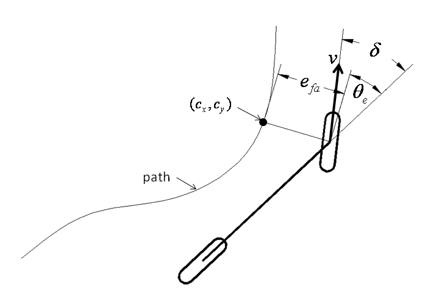

# Autonomous Navigation in Urban Environment

This repository contains capstone project files for AuE 8930: Autonomous Driving Technologies graduate course.

The project contains the following four tasks for which the code was written to be run on `Arduino` embedded platform mounted on a [F1Tenth race car](https://f1tenth.org/):

## 1. Lane marking detection using `Canny Edge Detection Algorithm`
Process flowchart:

The camera mounted at the front of the vehicle used to perceive the surroundings and extract lane-marking data.

Edge detection is one of the critical processes of the lane tracking control. Correctness of lane tracking control is determined by the effectivity of the edge detection algorithm. In this project, we have used canny edge detection algorithm to detect edges in the image. Canny edge detector is an edge detection algorithm that uses a multi-stage algorithm to detect a wide range of edges in images. The process of canny edge detection algorithm takes place in five steps:
* Application of Gaussian filter to smooth the image in order to remove the noise
* Determine the intensity gradients of the image
* Get rid of spurious response to edge detection by applying non-maximum suppression
* Apply double threshold to determine potential edges
* Finalize the detection of edges by suppressing all the other edges that are weak and not connected to strong edges

## 2. Lane keeping using `Stanley Controller`

The output of the lane marking detection was fed to the lane-keeping control algorithm. The lane-keeping control algorithm used in this project is `Stanley Controller`. It is the path tracking approach used by Standford University’s Darpa Grand Challenge team. Stanley controller uses both the heading error and cross-track error to determine the steering response needed. In this method, the cross-track error is defined as the distance between the closest point on the path with the front axle of the vehicle.

## 3. Road sign detection using `Region Based Convolutional Neural Networks (R-CNN)`
Process flowchart:

Task was to recognize ‘Stop’ and ‘School’ sign. This was achieved using deep learning approach. For training the neural network, we began with taking as much photos, of the two sign boards, as possible and from all possible angles. Thus, we used almost 1500 images of each sign board to train the network. Region-based Convolutional Neural Network (R-CNN) was used to perform the road sign recognition.
R-CNN model is used due to its relatively simple training procedure and good reliability. It is also faster than the CNN Transfer learning since it uses cropped and small region images. R-CNN network was trained using CIFAR10 Network.

## 4. Establish `User Datagram Protocol (UDP)` communication network to communicate sensory input from 'Road-sign Recognition' node
Two nodes were used to receive the sensory data in this project. The first node was used to receive sensory data from front camera which was used for lane tracking. Second node was used to receive sensory data from the side mounted camera which was used for road sign recognition. Hence, to control the vehicle using sensory data from both the sensors, it was necessary to establish a medium for communication between two nodes.

There were two options to establish a communication network - User Datagram Protocol (UDP) or Transmission Control Protocol (TCP). UDP was used for communications between the nodes. Although there are a lot of down sides to using UDP as it is not reliable, possibility of loss of datagrams, no sequencing, etc., it has one inherent benefit that it is a lightweight protocol. Since, our project is not really affected by reliability or loss of data, and we want small-size data transfer at fast rate, UDP communication protocol best suits this project. Thus, a UDP connection was established for communication between the two nodes.
